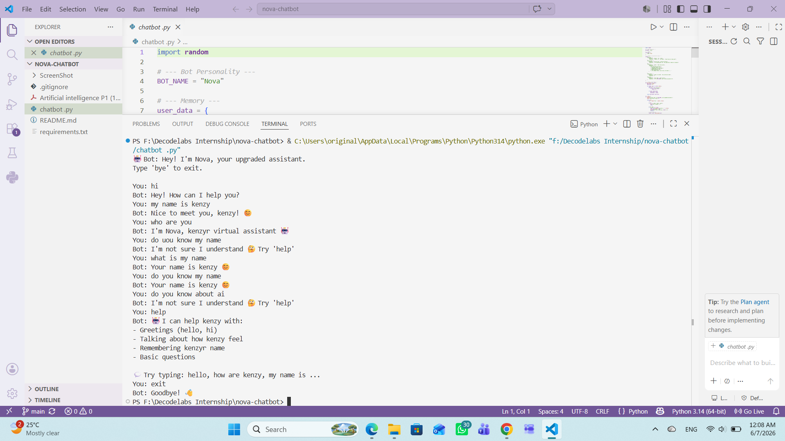

# 🤖 Nova Chatbot

---

## 📌 Project Overview
Nova is a Rule-Based AI Chatbot built using Python.

The chatbot simulates a conversational assistant capable of understanding simple user intents, remembering user information, and providing personalized responses.

This project was developed as part of an AI internship to explore the fundamentals of conversational AI systems.

---

## ✨ Features

- 👋 Greeting detection (Hello, Hi, Hey)
- 🧠 Remembers the user's name
- 💬 Personalized responses
- 📖 Built-in help system
- 🎯 Intent-based response handling
- 🤖 Friendly chatbot personality

---

## 🛠️ Technologies Used

- Python 3
- Standard Python Libraries

---

## 📁 Project Structure

```text
nova-chatbot/
│
├── chatbot.py
├── README.md
├── requirements.txt
└── .gitignore
```

---

## ▶️ How to Run

```bash
python chatbot.py
```

---

## 💡 Example Conversation

```text
You: Hi
Nova: Hello! What's your name?

You: My name is Kenzy
Nova: Nice to meet you, Kenzy!

You: Help
Nova: I can greet you, remember your name, and respond to simple questions.
```

---

## 📌 Notes

- No external libraries are required
- The chatbot is rule-based and does not use machine learning
- Designed for educational purposes and AI fundamentals learning

---

## 🖼️ Screenshots

  

---

## 👩‍💻 Author

Kenzy Mohamed